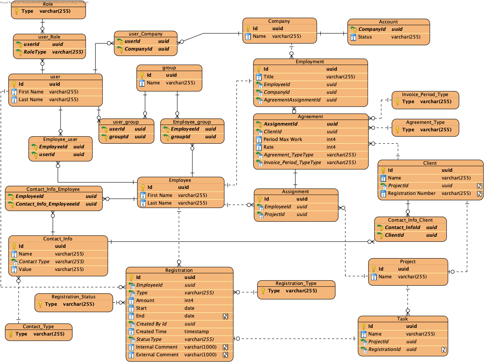

# Database Schema



## How to run the database

Make sure you have docker installed on your machine

navigate to 'database/Data' and run this docker command:

```
docker compose up -d
```

The PostgreSQL database will now be running locally on your machine, creating tables and test data.
To close the connection again run:

```
docker compose down
```
